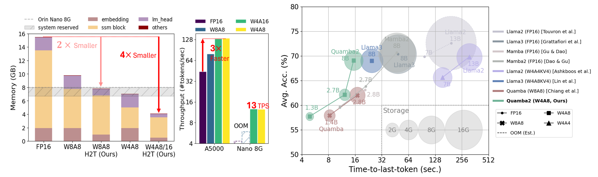
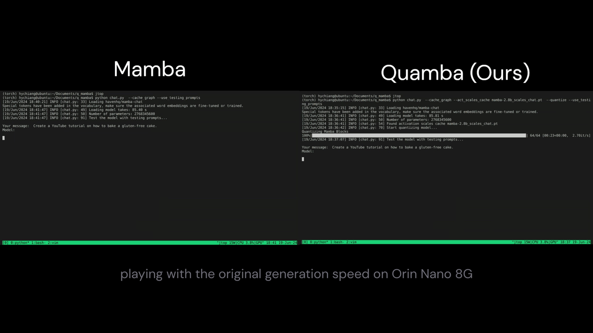

# Quamba

[Hung-Yueh Chiang](https://hychiang.info/),
[Chi-Chih Chang](https://ccchang.info/),
[Natalia Frumkin](https://www.nfrumkin.com),
[Kai-Chiang Wu](https://people.cs.nycu.edu.tw/~kcw/),
[Mohamed S. Abdelfattah](https://www.mohsaied.com/),
[Diana Marculescu](https://users.ece.utexas.edu/~dianam/)


[](https://arxiv.org/pdf/2503.22879)
[](https://hychiang.info/projects/quamba2/)


- 🔧 Supports W4A8 / W4A16 / W4AX / W8A8 for Mamba1 and Mamba2
- 🔻 4× memory reduction
- 🚀 Achieves 13 tokens per second on Orin Nano 8G with Mamba2-8b




## Real-time Generation on a NVIDIA Orin Nano 8G


## Setup

### Hardware Requirements
- NVIDIA GPU Ampere architecture or above

### Software Requirements
- CUDA 12.1 or above
- CMAKE version 3.22.1 or above

### Clone Quamba
- Clone the repository with all submodules:
```bash
git clone --recurse-submodules git@github.com:enyac-group/Quamba.git
# or
cd Quamba
git submodule update --init --recursive
```

- Run in docker (optional)

To build the docker image with customized kernels, run the following commands:
```bash
cd docker
./build_docker.sh
./run.sh # launch the container
```

Or Pull the pre-built docker image by
```bash
docker image pull hychiang/quamba-cuda-12.1:latest
```

- Create Quamba conda environment
```bash
cd Quamba
conda create -n quamba python=3.10
conda activate quamba
pip install -r requirements.txt
```

### Build 3rd-party Libraries

- Install `fast-hadamard-transform`:
```bash
# set force build to include 12N, 40N from the newer commit
export FAST_HADAMARD_TRANSFORM_FORCE_BUILD=TRUE
pip install 3rdparty/fast-hadamard-transform
```

- Install `lm-evaluation-harness`:
```bash
# lm_eval-0.4.2 word2number-1.1
pip install 3rdparty/lm-evaluation-harness
``````

- Install mamba
```bash
# set force build to use the commit for Quamba
export MAMBA_FORCE_BUILD=TRUE
pip install 3rdparty/mamba
```

- Install CUTLASS
```bash
# cmake version >= 3.22.1
bash build_cutlass.sh
```

- Install Megatron-LM
```bash
pip install -e 3rdparty/Megatron-LM
# Not sure why Megatron-LM will force to install pytorch 2.6.0+cu124,
# run `pip install -r requirements.txt` again if necessary
```

### Build Quamba
```bash
pip install .
```

## Model Zoo
| Models    | W8A8     |  W4A8       |  W4A16  |  W4AX |
| --------- | ---------|-------------|--------------|------|
| [Mamba1](https://huggingface.co/collections/ut-enyac/quamba-67edf67881154f4a12e41cb3)    | ✅  |  ✅ | ✅ | - |
| [Mamba2](https://huggingface.co/collections/ut-enyac/quamba2-67edf74a0880f7fba8438cc3)    | ✅  |  ✅ | ✅ | 8B |

✅ : support all sizes, *e.g*, Mamba2 130m/370m/780m/1.3b/2.7b/8b

## Download Models
```bash
# huggingface-cli download ut-enyac/quamba2-{size}-{precision}  --local-dir pretrained_models/ut-enyac/quamba2-{size}-{precision}
huggingface-cli download ut-enyac/quamba2-2.7b-w4a8  --local-dir pretrained_models/ut-enyac/quamba2-2.7b-w4a8
```

## Generate

```bash
python generate.py ut-enyac/quamba2-2.7b-w4a8 --prompt "My cat wrote all this CUDA code for a new language model and" --topp 0.9 --temperature 0.7 --repetition_penalty 1.2 --quantize --cache_graph --pretrained_dir pretrained_models
```

## Evaluate
```bash
bash eval.sh ut-enyac/quamba2-2.7b-w4a8
```


## Profile latency and memory

- To profile model size, use `--size`:
```bash
python profile_mamba.py ut-enyac/quamba2-2.7b-w4a8 --prompt_len 512 --size --pretrained_dir pretrained_models
```

- To profile time-to-first-token (prefilling stage), use `--ttft`:
```bash
python profile_mamba.py ut-enyac/quamba2-2.7b-w4a8 --prompt_len 512 --ttft --pretrained_dir pretrained_models
```

- To profile time-per-output-token (generation stage), use `--tpot --cache_graph`:
```bash
python profile_mamba.py ut-enyac/quamba2-2.7b-w4a8 --tpot --cache_graph --pretrained_dir pretrained_models
```

- To profile time-to-last-token (prefilling + generation stage), use `--ttlt --cache_graph`:
```bash
python profile_mamba.py ut-enyac/quamba2-2.7b-w4a8 --prompt_len 512 --gen_len 512 --ttlt --cache_graph --pretrained_dir pretrained_models
```

## Chat (Mamba1 Only)

```bash
huggingface-cli download ut-enyac/quamba-chat-w4a8  --local-dir pretrained_models/ut-enyac/quamba-chat-w4a8 
python chat.py ut-enyac/quamba-chat-w4a8 --cache_graph --pretrained_dir ./pretrained_models
```

## Mamba2-8B

**[TL;DR]** We provide the 8B model in all precision formats on Hugging Face. To use it, run:
```bash
huggingface-cli download ut-enyac/quamba2-8b-converted-w4a8  --local-dir pretrained_models/ut-enyac/quamba2-8b-converted-w4a8
python main.py ut-enyac/quamba2-8b-converted-w4a8 \
--batch_size 16 \
--eval_zero_shot \
--task_list lambada_openai \
--pretrained_dir ./pretrained_models \
--log_dir logs
```

### Convert Nvidia Mamba2-8B to HuggingFace

Download the checkpoint using `huggingface-cli`
```bash
huggingface-cli download nvidia/mamba2-8b-3t-4k --local-dir ./pretrained_models/mamba2-8b-3t-4k
```
After downloading, you will have the directory `./pretrained_models/mamba2-8b-3t-4k` having a structure like this
```bash
├── latest_checkpointed_iteration.txt
├── mt_nlg_plus_multilingual_ja_zh_the_stack_frac_015_256k.model (This is tokenizer)
├── README.md
└── release
    └── mp_rank_00
        └── model_optim_rng.pt (This is weights)
```
+ Run the conversion scripts to get the model directory
```bash
python convert_mamba2_8b_to_hf.py \
./pretrained_models/mamba2-8b-3t-4k/release/mp_rank_00/model_optim_rng.pt \
./pretrained_models/mamba2-8b-3t-4k/mt_nlg_plus_multilingual_ja_zh_the_stack_frac_015_256k.model \
--model_save_path ./pretrained_models/mamba2-8b-converted
```

### Quantize and Evaluate Mamba2-8B

After running, you will see a directory called `mamba2-8b-converted` has been created. Then you can run it with evaluation, profiling as the instructions above. However, it requires at least *24GB* memory on the GPU to quantize the Mamba2-8b model.

For example:
```bash
# use the `--pretrained_dir` flag to store the quantized model
python main.py pretrained_models/mamba2-8b-converted \
--batch_size 16 \
--eval_zero_shot \
--task_list lambada_openai \
--quantize \
--group_heads \
--apply_gptq \
--quantize_embedding \
--quantize_lm_head \
--w_bits 4 \
--a_bits 8
--pretrained_dir ./pretrained_models \
--log_dir logs
``` 

# Run Mixed-precision Quamba2-8B-W4AX
**[TL;DR]** We provide the W4AX 8B model on Hugging Face. To use it, run:
```bash
huggingface-cli download ut-enyac/quamba2-8b-converted-w4aX  --local-dir pretrained_models/ut-enyac/quamba2-8b-converted-w4aX
python main.py ut-enyac/quamba2-8b-converted-w4aX \
--batch_size 16 \
--eval_zero_shot \
--task_list lambada_openai \
--pretrained_dir ./pretrained_models \
--log_dir logs
```

### Quantize and Evaluate Qamba2-8B-W4AX
Follow the previous steps to convert the Mamba2-8B first, and then run
```bash
# use the `--pretrained_dir` flag to store the quantized model
# it will store the mixed-precision model with the name 
# ut-enyac/mamba2-8b-converted-w4aX-hybrid_blocks_config
python main.py pretrained_models/mamba2-8b-converted \
--batch_size 16 \
--eval_zero_shot \
--task_list lambada_openai \
--quantize \
--group_heads \
--apply_gptq \
--quantize_embedding \
--quantize_lm_head \
--w_bits 4 \
--hybrid_blocks \
--hybrid_blocks_config configs/hybrid/mamba2-8b/hybrid_blocks_config.json \
--pretrained_dir ./pretrained_models \
--log_dir logs
```

## Citation
```
@inproceedings{chiang2025quamba2,
  title = {Quamba2: A Robust and Scalable Post-training Quantization Framework for Selective State Space Models},
  author = {Chiang, Hung-Yueh and Chang, Chi-Chih and Frumkin, Natalia and Wu, Kai-Chiang, Abdelfattah, Mohamed S.  and Marculescu, Diana},
  booktitle = {Forty-Second International Conference on Machine Learning (ICML)},
  year = {2025}
}
@inproceedings{chiang2025quamba,
  title = {Quamba: A Post-Training Quantization Recipe for Selective State Space Models},
  author = {Chiang*, Hung-Yueh and Chang*, Chi-Chih and Frumkin, Natalia and Wu, Kai-Chiang and Marculescu, Diana},
  booktitle = {The Thirteenth International Conference on Learning Representations (ICLR)},
  year = {2025},
}
````
